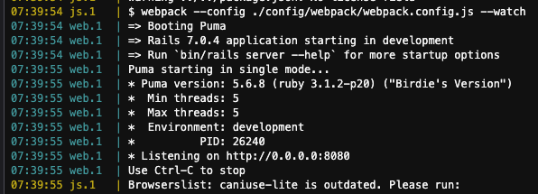
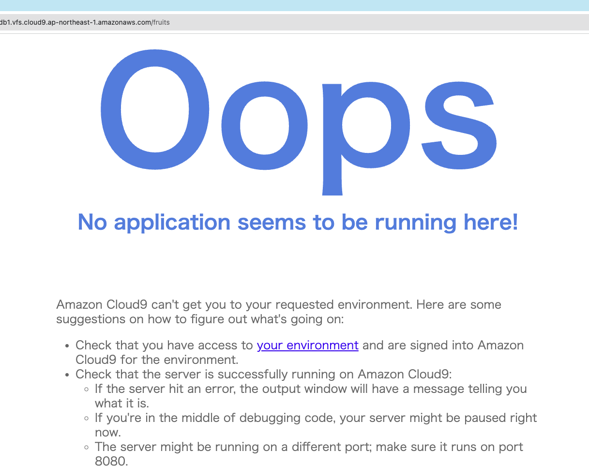
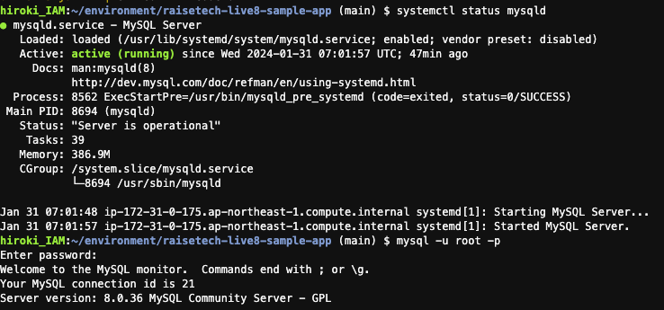

## 学んだこと
- .sockとはUnixソケットファイルの拡張子で、このファイルを介してマシン上の異なるプロセスが通信することを実現できる特殊なファイルである。
- RailsのDBや連携するためのsocketの設定方法
- mysqlのバージョンは`mysql --version`だけでなくデータベース内で`SELECT VERSION();`として表示する方法もある

## 感じたこと
- 細かいバージョンや設定を間違えたり忘れていたりするとアプリケーションが動かないのがセンシティブである。
- BundlerによるGemとそのバージョン、その他サーバーに必要なライブラリの構成管理の重要性を実感した。

## 課題
1. AP サーバーについて調べる 
  - ブラウザからのアクセス
  
  - APサーバーの名前とバージョン
    - Puma / version: 5.6.8
  
  - APサーバーを終了するとアクセスできない
  
1. DB サーバーについて調べる      
  - アプリで使っているDBエンジンの名前
    - MySQL Server
  - Cloud9で動作しているバージョン
    - 8.0.36
  
  - DBサーバーを終了した場合
    - Railsアプリケーションはdbへの接続エラーになる
  
  - Railsの構成管理ツールの名前
    - **Bundler**
